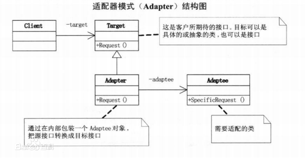

## 适配器模式

**定义**：将一个类的接口适配成用户所期待的。一个适配允许通常因为接口不兼容而不能在一起工作的类工作在一起，做法是将类自己的接口包裹在一个已存在的类中

**对象适配器模式**
- 在这种适配器模式中，适配器容纳一个它包裹的类的实例。在这种情况下，适配器调用被包裹对象的物理实体。

**类适配器模式**
- 这种适配器模式下，适配器继承自已实现的类（一般多重继承）。

**类图**：

使用场景：场景通常情况下是，系统中有一套完整的类结构，而我们需要利用其中某一个类的功能（通俗点说可以说是方法），但是我们的客户端只认识另外一个和这个类结构不相关的接口，这时候就是适配器模式发挥的时候了，我们可以将这个现有的类与我们的目标接口进行适配，最终获得一个符合需要的接口并且包含待复用的类的功能的类。