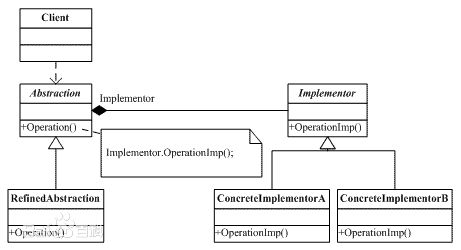

## 桥接模式

**定义**：在软件系统中，某些类型由于自身的逻辑，它具有两个或多个维度的变化，那么如何应对这种“多维度的变化”？如何利用面向对象的技术来使得该类型能够轻松的沿着多个方向进行变化，而又不引入额外的复杂度？这就要使用Bridge模式。

**类图**：

**适用性**：

1. 如果一个系统需要在构件的抽象化角色和具体化角色之间增加更多的灵活性，避免在两个层次之间建立静态的联系。
2. 设计要求实现化角色的任何改变不应当影响客户端，或者说实现化角色的改变对客户端是完全透明的。
3. 一个构件有多于一个的抽象化角色和实现化角色，系统需要它们之间进行动态耦合。
4. 虽然在系统中使用继承是没有问题的，但是由于抽象化角色和具体化角色需要独立变化，设计要求需要独立管理这两者
