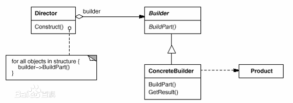

## 建造者模式
**定义**：将一个复杂对象的构造与它的表示分离，使同样的构建过程可以创建不同的表示，这样的设计模式被称为建造者模式。

**类图**：

**缺点**

1. 对象的构建过程非常复杂，每次客户端调用的时候，都要自己控制构建过程，这会导致构建过程的重复，而且非常容易忘记某一个步骤。
2. 对象的表示是可以变化的，所以如果要重复制造几个表示相同的对象的时候，只能每次都将过程和表示重复一遍。

**优点**

1. 最主要的好处是，使得对象的构建与表示分离，可以让表示独立于过程而独立的变化，并且客户端不再需要关心具体的构建过程和表示。
2. 由于固定的表示由具体的制造者提供，所以要重复制造几个表示相同的对象的时候，只需要让指挥者控制制造者再进行一次即可。

**适用场景**

1. 当对象的构建过程十分复杂，需要与表示分离的时候。
2. 当对象的表示有不同种类，需要加以区分的时候。