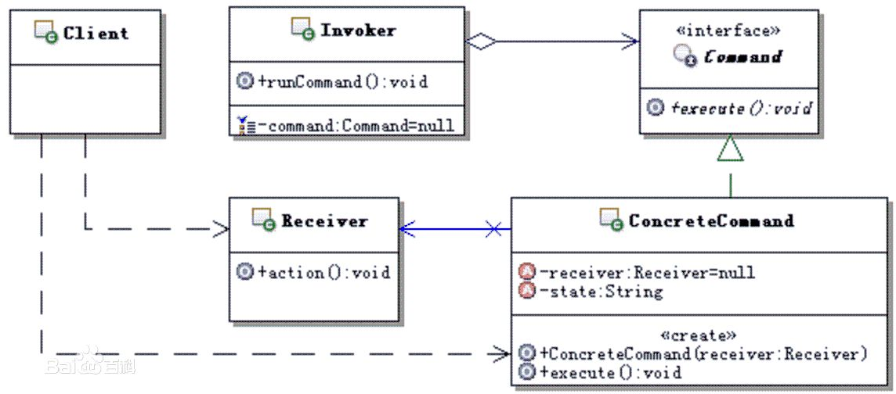

## 命令模式

**定义**：将请求封装成对象，以便使用不同的请求、日志、队列等来参数化其他对象。命令模式也支持撤销操作。

**类图**：

1. 抽象命令（Command）：定义命令的接口，声明执行的方法。
2. 具体命令（ConcreteCommand）：具体命令，实现要执行的方法，它通常是“虚”的实现；通常会有接收者，并调用接收者的功能来完成命令要执行的操作。
3. 接收者（Receiver）：真正执行命令的对象。任何类都可能成为一个接收者，只要能实现命令要求实现的相应功能。
4. 调用者（Invoker）：要求命令对象执行请求，通常会持有命令对象，可以持有很多的命令对象。这个是客户端真正触发命令并要求命令执行相应操作的地方，也就是说相当于使用命令对象的入口。
5. 客户端（Client）：命令由客户端来创建，并设置命令的接收者。

**模式总结**

**优点**

1. 解除了请求者与实现者之间的耦合，降低了系统的耦合度。
2. 对请求排队或记录请求日志，支持撤销操作。
3. 可以容易地设计一个组合命令。
4. 新命令可以容易地加入到系统中。

**缺点**

1. 因为针对每一个命令都需要设计一个具体命令类，使用命令模式可能会导致系统有过多的具体命令类。

**适用场景**

1. 当需要对行为进行“记录、撤销/重做”等处理时。
2. 系统需要将请求者和接收者解耦，使得调用者和接收者不直接交互。
3. 系统需要在不同时间指定请求、请求排队和执行请求。
4. 系统需要将一组操作组合在一起，即支持宏命令。