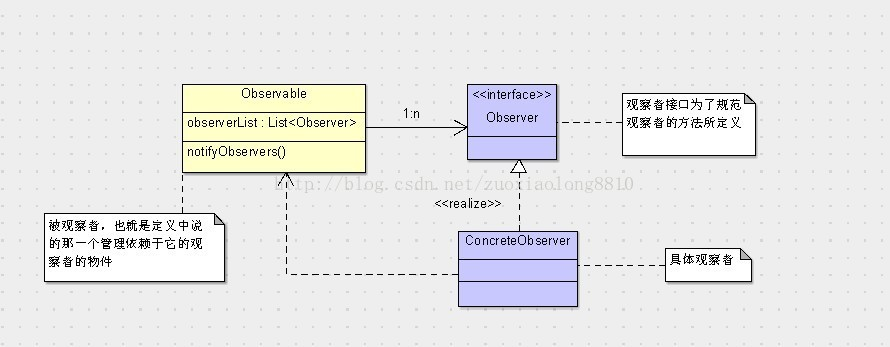

## 观察者模式

**定义**： 观察者模式（有时又被称为发布-订阅模式、模型-视图模式、源-收听者模式或从属者模式）是软件设计模式的一种。在此种模式中，一个目标物件管理所有相依于它的观察者物件，并且在它本身的状态改变时主动发出通知。这通常透过呼叫各观察者所提供的方法来实现。此种模式通常被用来实作事件处理系统。

**简单点概括成通俗的话来说，就是一个类管理着所有依赖于它的观察者类，并且它状态变化时会主动给这些依赖它的类发出通知。
观察者模式分离了观察者和被观察者二者的责任，这样让类之间各自维护自己的功能，专注于自己的功能，会提高系统的可维护性和可重用性。**
**类图**：

观察者模式：发布（release）--订阅（subscibe），变化（change）--更新（update）

               事件驱动模型：请求（request）--响应（response），事件发生（occur）--事件处理（handle）