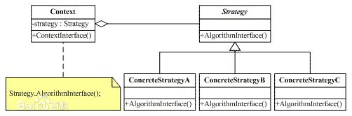

# 策略模式
**定义**：策略模式定义了一系列的算法，并将每一个算法封装起来，而且使它们还可以相互替换。策略模式让算法独立于使用它的客户而独立变化。

分析下定义，策略模式定义和封装了一系列的算法，它们是可以相互替换的，也就是说它们具有共性，而它们的共性就体现在策略接口的行为上，另外为了达到最后一句话的目的，也就是说让算法独立于使用它的客户而独立变化，我们需要让客户端依赖于策略接口。

**类图**：

### 工厂模式和策略模式比较
**工厂模式**：有一天你决定去吃披萨，一看菜单，哦，种类很多呀，你就点了个培根披萨，过了二十分钟，你的披萨就来了就可以吃到了。但这个披萨是怎么做的，到底面粉放了多少，培根放了多少，佐料放了多少，有多少到工序，你是不需要管的，你需要的是一个美味培根披萨。

**策略模式**：同样还是在披萨店，你要一个培根披萨，老板说想吃自己去做吧。原料有培根、面粉、佐料。工序有1、2、3工序，你自己去做吧。然后你就需要自己去做，到底放多少培根，放多少面粉，放多少佐料，这都你自己来决定，工序1、2、3，你是怎么实现的，都你自己决定。最后你得到了披萨。

一般情况下，策略模式是为了解决的是策略的切换与扩展，更简洁的说是定义策略族，分别封装起来，让他们之间可以相互替换，策略模式让策略的变化独立于使用策略的客户。可以应用的场景有优惠系统、工资计算系统等。上例中，你可以自己做多种口味的披萨的，青菜的，牛肉的，海鲜的你都可以一次都做。而工厂模式主要解决的是资源的统一分发，将对象的创建完全独立出来，让对象的创建和具体的使用客户无关。主要应用在多数据库选择，类库文件加载等。上例中你可以点很多披萨，只要披萨店给提供的，你都可以点。很明显的是策略模式是开放的，作为一个主体你的活动范围是全程的，大多数事情要你自己亲力亲为。而工厂模式作是封闭的，作为主体的你的活动范围是有限的，很多事情都帮组你做好了，你直接“点”就可以了。

