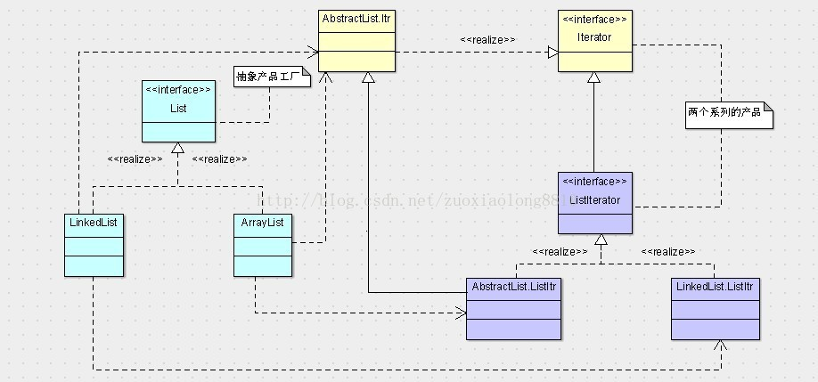

## 抽象工厂模式
**定义**：为创建一组相关或相互依赖的对象提供一个接口，而且无需指定他们的具体类。

**类图**：

#### 实例：

在集合框架里，有一个不太明显的抽象工厂模式，就是List接口，它在iterable的基础上，扩展了一个创建产品的方法

1. List，是抽象工厂的角色，它有两个制造产品的方法，iterator和listIterator，相当于Creator。
2. ListIterator和Iterator都是抽象产品，相当于ProductA和ProductB。其中ListIterator有两个实现类，分别是AbstractList.ListItr和LinkedList.ListItr，相当于ProductA1和ProductA2。Iterator的实现类为AbstractList.Itr，相当于ProductB1，但是没有B2。
3. LinkedList是其中一个具体的工厂类，相当于ConcreteCreator1，实现抽象工厂List，它制造的两个具体产品分别是LinkedList.ListItr和AbstractList.Itr。
4. 同样的，ArrayList也是一个具体的工厂类，相当于ConcreteCreator2，实现抽象工厂List，它制造的两个具体产品分别是AbstractList.ListItr和AbstractList.Itr。

ArrayList和LinkedList分别是List接口的两种实现，前者是基于数组操作，后者是基于链表。两者都可以产生Iterator和ListIterator，而Iterator的实现都是在AbstractList中实现的，是一样的处理方式，而对于ListIterator的实现却不相同，AbstractList.ListItr是基于数组的操作，LinkedList.ListItr是基于链表的操作方式。
所以抽象工厂模式一般是为了处理抽象产品多于一个的问题，而且这些产品多数情况下是有关系的，像上述JAVA集合框架的例子当中，Iterator和ListIterator就是继承的关系，大部分情况下，很少会使用抽象工厂模式去创造一批毫无关系的产品。
基于抽象工厂一旦定义，抽象产品的个数就已经固定，所以最好在抽象产品的个数不太会变化的情况下使用抽象工厂模式，当然，我们可以使用继承去弥补抽象工厂模式的这一不足，创造另外一个继承体系去扩展现有的框架。

#### 三种设计模式依次进化的原因

1. 首先从简单工厂进化到工厂方法，是因为工厂方法弥补了简单工厂对修改开放的弊端，即简单工厂违背了开闭原则。
2. 从工厂方法进化到抽象工厂，是因为抽象工厂弥补了工厂方法只能创造一个系列的产品的弊端。