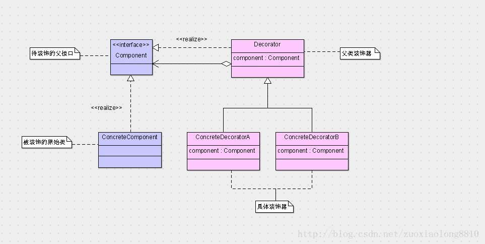
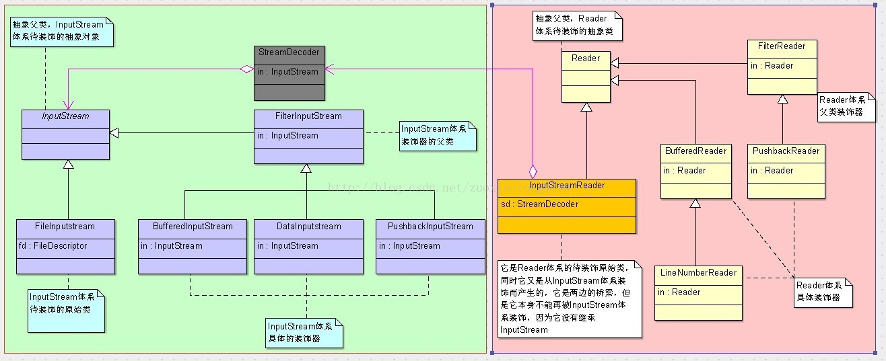

## 装饰模式

**定义**：在不必改变原类文件和使用继承的情况下，动态地扩展一个对象的功能。它是通过创建一个包装对象，也就是装饰来包裹真实的对象

1. 不改变原类文件。
2. 不使用继承。
3. 动态扩展。

**类图**：

**IO包中所涉及的类的类图**:

上述的XXXXInputStream的各个类都继承了InputStream，这样做不仅是为了复用InputStream的父类功能（InputStream也是一种模板方法模式，它定义了read(byte[])方法的简单算法，并将read()方法交给具体的InputStream去实现），也是为了可以重叠装饰，即装饰器也可以再次被装饰，而过渡到Reader以后，Reader的装饰器体系则是类似的