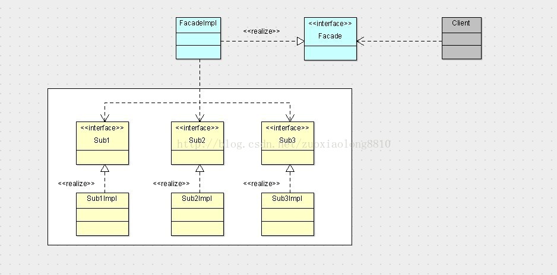

## 外观模式
**定义**：外观模式是软件工程中常用的一种软件设计模式。它为子系统中的一组接口提供一个统一的高层接口。这一接口使得子系统更加容易使用。

**类图**：

主要由两部分组成，一部分是子系统（包括接口，实现类，等等），一部分是外观接口和实现类，外观接口负责提供客户端定制的服务，外观实现则负责组合子系统中的各个类和接口完成这些服务，外观接口则是提供给客户端使用的，这样就解除了客户端与子系统的依赖，而让客户端只依赖于外观接口，这是一个优秀的解耦实践

1. 实际使用当中，接口并不是必须的，虽说根据依赖倒置原则，无论是处于高层的外观层，还是处于底层的子系统，都应该依赖于抽象，但是这会倒置子系统的每一个实现都要对应一个接口，从而导致系统的复杂性增加，所以这样做并不是必须的。
2. 外观接口当中并不一定是子系统中某几个功能的组合，也可以是将子系统中某一个接口的某一功能单独暴露给客户端。
3. 外观接口如果需要暴露给客户端很多的功能的话，可以将外观接口拆分为若干个外观接口，如此便会形成一层外观层。