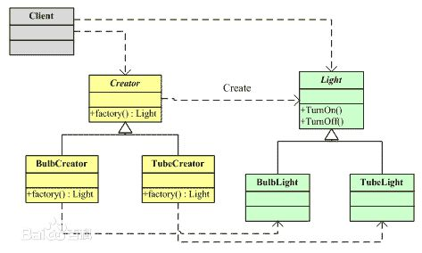
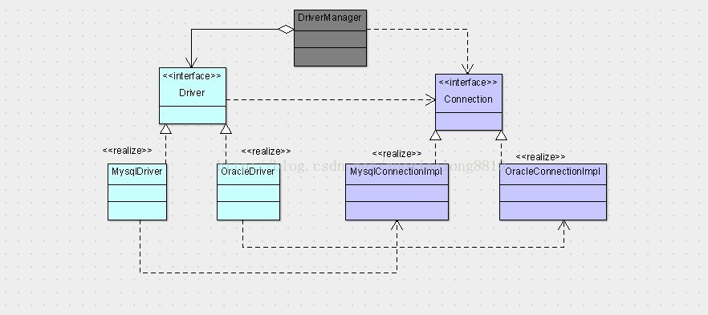
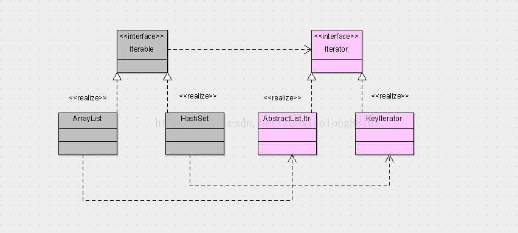

## 工厂方法模式
**定义**：工厂方法(Factory Method)模式的意义是定义一个创建产品对象的工厂接口，将实际创建工作推迟到子类当中。核心工厂类不再负责产品的创建，这样核心类成为一个抽象工厂角色，仅负责具体工厂子类必须实现的接口，这样进一步抽象化的好处是使得工厂方法模式可以使系统在不修改具体工厂角色的情况下引进新的产品。

    工厂方法模式的好处和适用的场景都相对比较好理解。

    好处就是，从类关系上来说，它可以让客户端与具体的工厂与产品解耦，从业务角度来说，它让客户端与具体的产品解耦。
    适用的场景就是我们需要一个产品帮我们完成一项任务，但是这个产品有可能有很多品牌（像这里的mysql，oracle），为了保持我们对产品操作的一致性，我们就可能要用到工厂方法模式。
    工厂方法模式也有它所不足的地方，可能你会说，这多好啊，我们操纵数据库不再需要关心具体是哪个数据库。是的，你很爽啊，那是因为这些产品的实现都不用你写啊，都是数据库厂商给你写的。
    假设产品数量巨多，而且需要我们亲手去逐个实现的时候，工厂方法模式就会增加系统的复杂性，到处都是工厂类和产品类，而且这里所说的工厂类和产品类只是概念上的，真正的产品可能不是一两个类就能搞定，否则mysql和oracle的驱动包为啥要那么多类，而不是就一个Driver和一个Connection。

**类图**：

**事例1**：
JDBC是如何统一了数据库世界的呢？

    第一，数据库厂商要提供一个数据库驱动类，它的作用可以是可以创造数据库连接，而这个数据库连接向上转型为我们JDBC的Connection。
    第二，数据库厂商要提供一个数据库连接的实现类，这个实现类可以执行具体数据库的各个操作，比如帮我们执行SQL，返回执行结果，关闭连接等等。

工厂方法模式就是提供一个抽象的工厂，一个抽象的产品，在上述当中相当于Driver（数据库连接工厂）和Connection（抽象产品），实现的一方需要提供一个具体的工厂类（比如mysql驱动）和一个具体的产品（比如mysql数据库连接）。

**事例2**：
HashSet和ArrayList

    我们使用iterable和iterator的时候，我们是关心真正产品的特性的，所以为了使用产品的特性，我们就需要使用产品特有的接口了，比如特殊的SortedSet可排序，比如ArrayList可以有重复元素，可以根据索引获取元素

**两种使用方式一种是对使用者透明的，一种是不透明的，一种是使用者对具体的产品不关心，这种情况下，一般产品提供的功能是类似的。一种是使用者非常了解产品的特性，并想使用产品的特性，这种情况下，一般产品只提供最基本的一致的功能，但每个产品都会有自己独特的一面。**