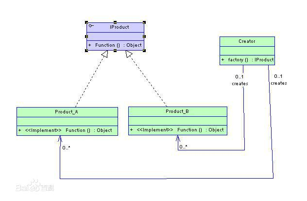

# 简单工厂模式
**定义**： 从设计模式的类型上来说，简单工厂模式是属于创建型模式，又叫做静态工厂方法（Static Factory Method）模式，但不属于23种GOF设计模式之一。简单工厂模式是由一个工厂对象决定创建出哪一种产品类的实例。简单工厂模式是工厂模式家族中最简单实用的模式，可以理解为是不同工厂模式的一个特殊实现。

**由一个工厂对象决定创建出哪一种产品类的实例**

**类图**：

总结起来就是一个工厂类，一个产品接口（其实也可以是一个抽象类，甚至一个普通的父类，但通常我们觉得接口是最稳定的，所以基本不需要考虑普通父类的情况），和一群实现了产品接口的具体产品，而这个工厂类，根据传入的参数去创造一个具体的实现类，并向上转型为接口作为结果返回。