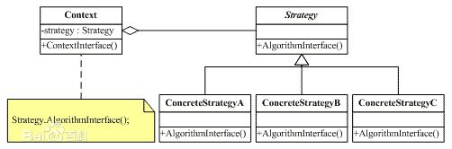

# 策略模式
**定义**：策略模式定义了一系列的算法，并将每一个算法封装起来，而且使它们还可以相互替换。策略模式让算法独立于使用它的客户而独立变化。

分析下定义，策略模式定义和封装了一系列的算法，它们是可以相互替换的，也就是说它们具有共性，而它们的共性就体现在策略接口的行为上，另外为了达到最后一句话的目的，也就是说让算法独立于使用它的客户而独立变化，我们需要让客户端依赖于策略接口。

类图：

