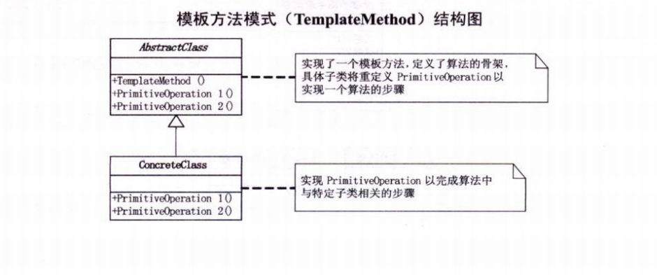

## 模版方法模式

**定义**：定义一个操作中的算法的骨架，而将一些步骤延迟到子类中。模版方法使得子类可以不改变一个算法的结构即可重定义该算法的某些特定步骤。

一般是为了统一子类的算法实现步骤，所使用的一种手段或者说是方式。它在父类中定义一系列算法的步骤，而将具体的实现都推迟到子类。
最典型的形式就是一个接口，一个抽象父类，父类中会有一系列的抽象方法，而在子类中去一一实现这些方法。

**类图**：

